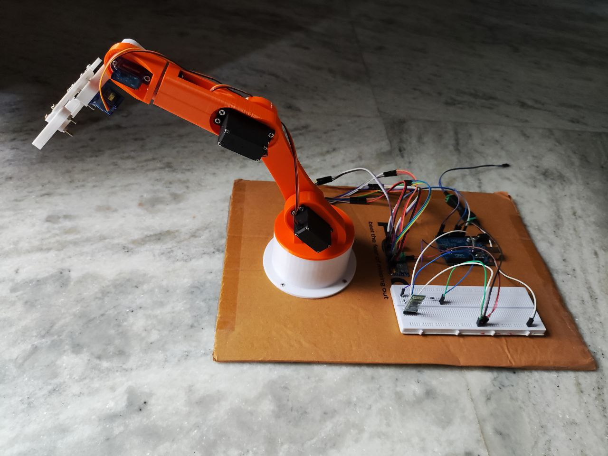

# 🤖 Multiplatform Robotic Arm

A cross-platform, Arduino-powered **robotic arm** controllable via a responsive web interface.  
Built for smooth operation, easy deployment, and compatibility with multiple platforms.

---

## 🚀 Live Demo
🔗 **[View the Web Interface](https://mutiplatform-robotic-arm.vercel.app)**  

⚠️ **Note:** Please use **Google Chrome** to access the web interface.  
Other browsers currently do not support the required features.

---

## 🎥 Demo in Action
| Web Interface | Physical Arm Movement |
|--------------|----------------------|
|  |  |

---

## 📜 Features
- **Arduino-based control** — precise servo motor movement.
- **Web-based UI** — control the arm from any device with a browser.
- **Cross-platform compatibility** — works on desktop and mobile.
- **Visual feedback** — includes circuit diagram and hardware images.
- **Preset positions** — save & run sequences automatically.

---

##  Buy 3D-Printed Parts

If you’d rather purchase ready-made components than print them yourself, consider these options:

- **[5-DOF Robotic Arm Plastic Parts (3D Printed, no electronics)](https://www.amazon.in/LINECRAFT-DESIGNS-Creativity-innovation-Reality/dp/B08Y7JZY99?dib=eyJ2IjoiMSJ9.aJl2brxEkKOLw464K-0Ccig3pAmeaVT-MIn6xXIXGr3igyK5XnN_9_GNA-aESs-Vnrwei6zc2vNcfYMRol27W5d2P4nSUbsfVpqEPcKGtf17XhZcVfZCBNkBExjjlolLBxxowaLOf8Swcs0RFabUOm_50PV4zPrSSfcUwfEQ2jzoBipzM7V-tOGTqClpYHuYXcCbJ8-JNKydVg51611kQYviS0vaKJi8lIT0IiBQbx65FND5pVkTXCrkpexduUosxW3mwy87dTYMK8bJH4GnQyiwA0DOCWCYMcxrm9NNP84.Lxw8pdm11txI8bEPeJKQqi8jIUBCnUpWE7i-rxzAdHA&dib_tag=se&keywords=robotic%2Barm&qid=1755025789&sr=8-5&th=1)** 

